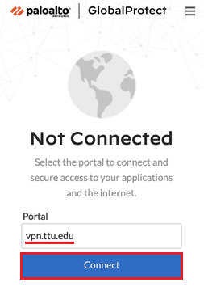
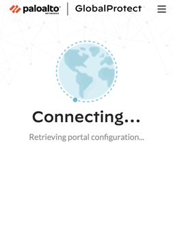
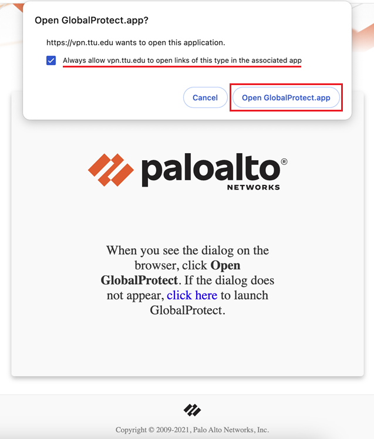
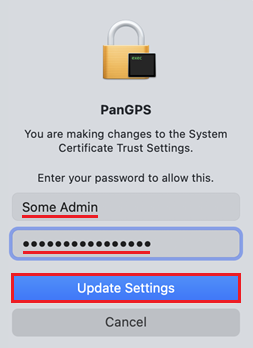

# How to Connect TTUnet VPN on Mac
1. If you haven’t already, download and install the GlobalProtect VPN software. 
2. Click the GlobalProtect icon in your Mac’s menu bar. 
 
3. In the Portal field, enter:
>vpn.ttu.edu 

Then click Connect. 
 
4. GlobalProtect will retrieve the configuration from the portal. Please wait while this process completes. 
 
5. Your system’s default browser will automatically open to begin the sign-in process. 
 
6. If the browser doesn’t open automatically, launch it manually and look for the GlobalProtect sign-in screen. It may appear in a new window separate from your open tabs. 
Sign in with your eRaider credentials. 
7. If prompted, click Open GlobalProtect.app to return to the application. 
 
8. If prompted regarding PanGPS, enter the username and password of a macOS user account with administrative privileges, then click Update Settings. 
 
9. Wait while the VPN connection is established. Once connected, the GlobalProtect icon will indicate an active connection. 
 

