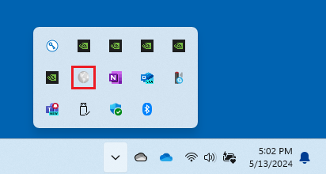
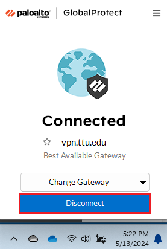

# How to Disconnect from TTUnet VPN (Windows)
1. Open GlobalProtect 
In the Notification Area at the bottom right of your screen, click the GlobalProtect icon. 

2. Click Disconnect 
In the GlobalProtect window, click the Disconnect button. 

