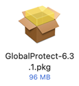
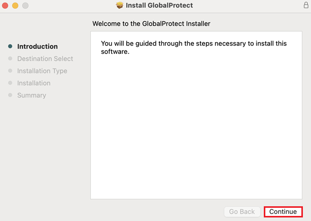
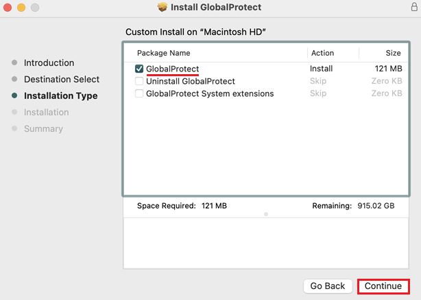
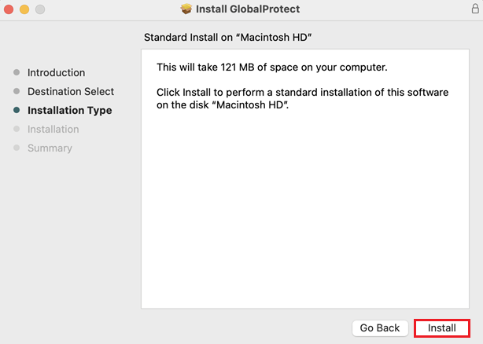
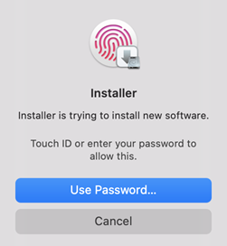
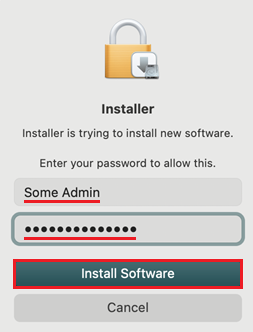
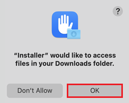
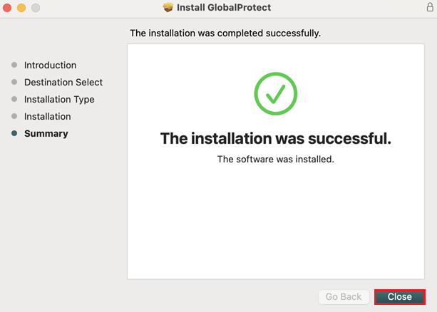
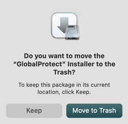
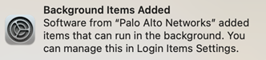

# How to Download GlobalProtect on Mac
1. Download the GlobalProtect installation package from the eRaider Software Downloads page. 
 
2. Locate and open the downloaded file. By default, this will be in your Downloads folder. 
 
3. Click Continue to begin the installation process. 
 
4. If asked to select a destination, choose the disk where you'd like to install the software, then click Continue. 
 
5. Select the checkbox labeled “GlobalProtect”, then click Continue. 
 
6. Click Install to proceed. 
 
7. When prompted, use Touch ID or enter an administrator username and password, then click Install Software. 
 
8. If asked to allow Installer access to your Downloads folder, click OK. 
 
9. Once installation is complete, click Close. 
 
10. If prompted to keep or move the installation package to the trash, choose your preferred option. 
 
11. You may also be asked to allow notifications—choose your preferred setting. 
 

