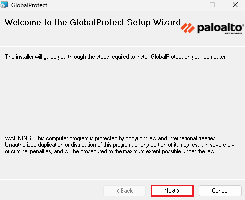
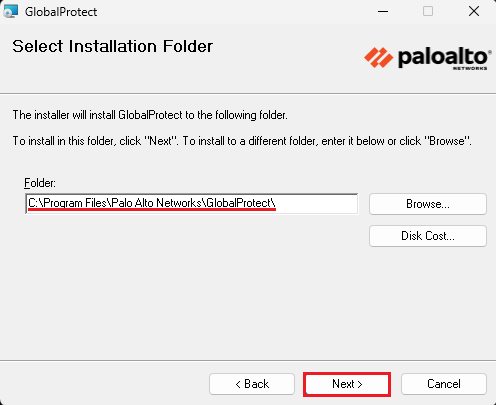
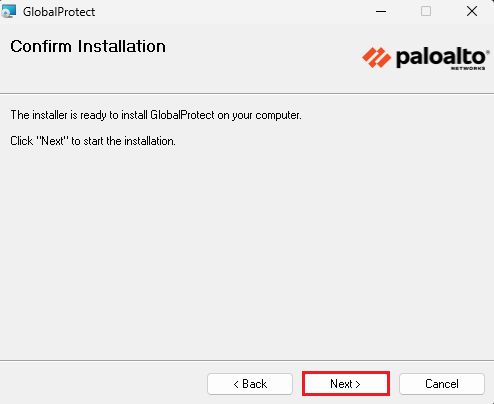
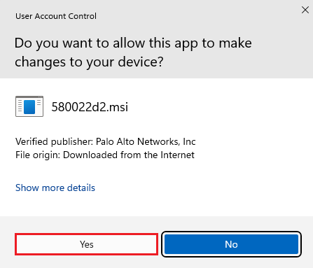
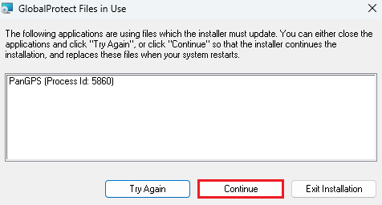
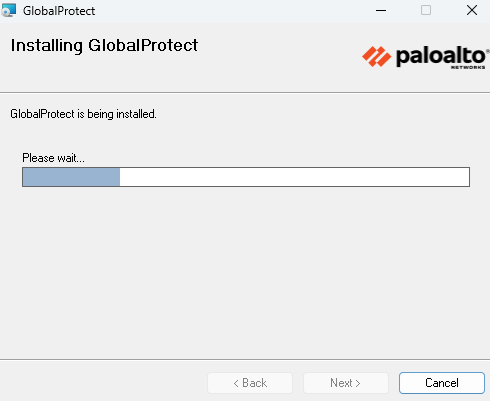
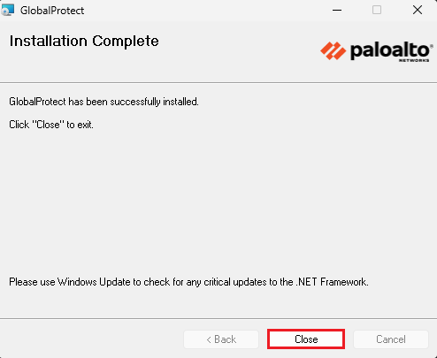
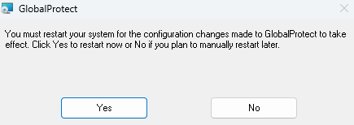

# How to Download GlobalProtect on Windows
**NOTE:** You must have administrative privileges on your computer before starting these steps.

1. Download the **GlobalProtect software** from the [IT Online Software Store](https://software.ttu.edu/).
2. Locate and open the downloaded file. It is typically saved in your **Downloads** folder.
Make sure to install the correct version based on your system type (64-bit or 32-bit Windows). Both versions are included in the download package. 
 
3. Click **Next** to begin installation 
 
4. Select the installation folder, then click Next. 
 
5. Click Next to confirm and proceed 
 
6. If promted by User Account Control, click Yes to allow the installation 
 
7. If you receive a message about GlobalProtect files being in use click Continue to proceed. 
 
8. Wait for the installation to complete. 
 
9. Once installation is finished, click Close 
 
10. If prompted to restart your computer, select your prefered option. Restarting is recommended to complete the installation and begin using the software. 
 

